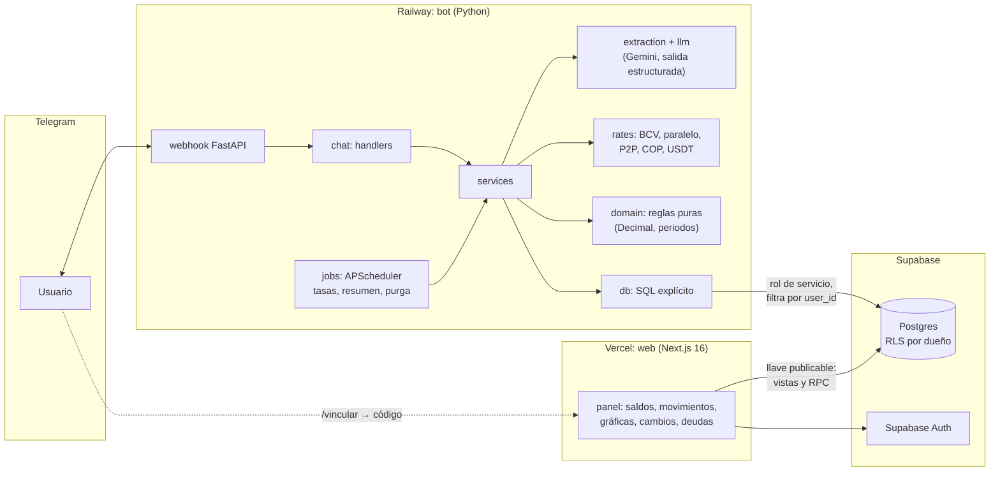

# Asistente de gastos multimoneda

Para quien vive con varias monedas a la vez. Le escribes a un bot de Telegram como le hablarías a alguien («gasté 15 en el almuerzo», «cambié 50 usdt a bs a 985») y el bot anota el movimiento en su moneda original: bolívares, pesos colombianos, dólares o USDT. Cada movimiento se guarda con la tasa del momento. Una web muestra todo en un solo lugar.

- **Bot:** [@frankly_gastos_bot](https://t.me/frankly_gastos_bot) (acceso por lista blanca).
- **Web:** <https://asistente-gastos-multimoneda.vercel.app>.
- **App Android:** [descarga el APK](https://github.com/FranklyBautista/asistente-gastos-multimoneda/releases/download/mobile-v1.0.0/asistente-gastos.apk) (Expo; misma cuenta que la web, vinculada con `/vincular`).

> Estado: **Fase 12**, hábitos: topes por categoría, colchón en días y contexto al anotar (en producción; falta la parte web). **Fase 13**, app móvil: APK Android en Expo en [`mobile/`](mobile/README.md) (saldos, movimientos, gráficas, cambios, deudas, colchón y topes, con bloqueo por huella).

## Qué hace

| En Telegram | En la web |
|---|---|
| Anota gastos, ingresos y varios movimientos en un mismo mensaje. Si la moneda no está clara (`$` puede ser USD o COP), pregunta con botones. | **Inicio:** saldo de cada cuenta y consolidado en USD, con la fuente de cada tasa y un aviso si está vieja. |
| Registra cambios entre monedas y compara la tasa que te dieron contra la de referencia. | **Movimientos:** filtros por moneda, tipo, categoría y fechas. Al editar uno se recalcula su equivalente en USD. |
| Responde preguntas («¿cuánto gasté en comida este mes?») con datos reales y sin cifras inventadas. | **Gráficas:** gasto por categoría y por semana, y poder adquisitivo del bolívar. |
| Cada domingo envía un resumen semanal que incluye cuánto perdieron o ganaron tus bolívares. | **Cambios:** historial con la tasa efectiva, la de referencia y la diferencia en %. |
| Aprende de tus correcciones («eso fue transporte»). | Las ediciones hechas en la web también le sirven al bot como ejemplos. |
| Lleva tus deudas («le debo 20 dólares a miguel», «luisa me debe 50 mil») y las tacha cuando se pagan; pregunta de qué cuenta salió el dinero. `/deudas` muestra lo pendiente. | **Deudas:** pendientes por persona y moneda con su total, y las liquidadas tachadas. |
| Topes por categoría en dólares («no quiero gastar más de 100 dólares al mes en comida»). Cada gasto anotado dice cómo vas en esa categoría; `/contexto` lo apaga y `/topes` muestra todos. | |
| Colchón en días: «¿cuánto me dura la plata?» o `/colchon` dice para cuántos días alcanza lo que tienes con tu gasto promedio. También sale en el resumen semanal. | |

Las tasas salen de BCV, el paralelo y Binance P2P para el Bs (cada persona elige su fuente), de ExchangeRate-API para el COP y de CoinGecko para el USDT. Se refrescan cada hora y quedan guardadas como historial.

## Métricas

- **Extracción con Gemini real** (`.\tasks.ps1 eval`, prompt `extraccion-v7`, 108 casos de [`bot/eval/dataset.jsonl`](bot/eval/dataset.jsonl); 103 respondidos, 5 sin respuesta por el límite del plan gratuito; [resultado](bot/eval/results/extraccion-v7.json)):
  - 101 de 103 casos exactos (98,1 %). Los dos fallos son frases ambiguas: «pagué 200 con pago móvil» no anotó nada (la moneda no se dice) y «le mandé 100 por zelle a mi hermano» se tomó como deuda en vez de gasto.
  - Intención acertada en 102 de 103.
  - Topes por categoría («no quiero gastar más de 100 dólares al mes en comida») en 25 de 25.
  - Moneda dudosa preguntada en 15 de 15 y moneda clara anotada en 35 de 35.
  - Categoría en 40 de 40, consultas en 39 de 39 y cambios entre monedas en 19 de 19.
  - Deudas: dirección («debo» frente a «me debe») en 15 de 15, deudas y pagos con todos sus campos (57 de 57).
- **Pruebas:**
  - Bot: unitarias e integración con pytest.
  - Base de datos: pgTAP sobre esquema, RLS, vinculación, panel y deudas.
  - Web: E2E con Playwright para registro, vinculación con `/vincular`, saldos, filtros, edición, gráficas, cambios, deudas (la liquidada aparece tachada) y el colchón y los topes en Inicio.
  - Todo corre en el CI de GitHub Actions.

## Arquitectura


```mermaid
flowchart LR
  subgraph Telegram
    U["Usuario"]
  end
  subgraph Railway["Railway: bot (Python)"]
    WH["webhook FastAPI"] --> H["chat: handlers"]
    H --> S["services"]
    J["jobs: APScheduler<br/>tasas, resumen, purga"] --> S
    S --> X["extraction + llm<br/>(Gemini, salida estructurada)"]
    S --> R["rates: BCV, paralelo,<br/>P2P, COP, USDT"]
    S --> DOM["domain: reglas puras<br/>(Decimal, periodos)"]
    S --> D["db: SQL explícito"]
  end
  subgraph Supabase
    PG[("Postgres<br/>RLS por dueño")]
    AUTH["Supabase Auth"]
  end
  subgraph Vercel["Vercel: web (Next.js 16)"]
    WEB["panel: saldos, movimientos,<br/>gráficas, cambios, deudas"]
  end
  U <--> WH
  D -- "rol de servicio,<br/>filtra por user_id" --> PG
  WEB -- "llave publicable:<br/>vistas y RPC" --> PG
  WEB --> AUTH
  U -. "/vincular → código" .-> WEB
```

- **El bot** usa una arquitectura por capas: cada capa solo importa de las de abajo, e `import-linter` lo verifica en el CI.
  - `domain` es puro, sin red ni base de datos.
  - El dinero va siempre en `Decimal` y las tasas siempre como `usd_per_unit`.
- **Los datos multimoneda** se guardan en su moneda original con un snapshot en USD. Los saldos se calculan, nunca se guardan ([ADR 0002](docs/decisions/0002-monedas.md)).
- **Nada se inventa:**
  - El LLM elige herramientas y periodos cerrados, y el código calcula las cifras ([ADR 0007](docs/decisions/0007-consultas.md)).
  - El resumen semanal rechaza cualquier número que no esté en los datos ([ADR 0008](docs/decisions/0008-resumen-semanal.md)).
- **La web** lee solo lo suyo:
  - Las lecturas pasan por RLS por dueño y las escrituras por funciones con validación ([ADR 0012](docs/decisions/0012-acceso-web-y-vinculacion.md)).
  - Los agregados del panel se calculan en SQL ([ADR 0014](docs/decisions/0014-panel-web.md)).

Más detalle en [`docs/STACK_Y_ARQUITECTURA.md`](docs/STACK_Y_ARQUITECTURA.md) y en las decisiones de [`docs/decisions/`](docs/decisions/).

## Demo

El guion del video (2–3 minutos, bot y web juntos) está en [`docs/DEMO.md`](docs/DEMO.md).

## Desarrollo

Requisitos: Git, Docker Desktop, [uv](https://docs.astral.sh/uv/), [Supabase CLI](https://supabase.com/docs/guides/cli) y Node 24. Las tareas comunes están en `tasks.ps1` (PowerShell, Windows).

```powershell
Copy-Item bot\.env.example bot\.env   # rellena los valores
.\tasks.ps1 setup                     # instala dependencias del bot
.\tasks.ps1 hooks                     # instala pre-commit (ruff + gitleaks)
.\tasks.ps1 db-up                     # levanta Supabase local (requiere Docker)
.\tasks.ps1 check                     # lint, tipos, capas, pruebas y pgTAP
.\tasks.ps1 run                       # arranca el bot en modo polling
.\tasks.ps1 web-setup                 # instala dependencias de la web
.\tasks.ps1 web                       # web en http://localhost:3000 (ver web/README.md)
.\tasks.ps1 web-check                 # lint, formato, tipos y build de la web
.\tasks.ps1 e2e                       # Playwright contra Supabase local
.\tasks.ps1 mobile-setup              # instala dependencias de la app móvil
.\tasks.ps1 mobile                    # Expo: abre la app con Expo Go (ver mobile/README.md)
.\tasks.ps1 mobile-check              # lint, formato, tipos y pruebas de la app
```

Para medir la extracción con el LLM real, `.\tasks.ps1 eval` corre las frases del set de evaluación y guarda el resultado en [`bot/eval/results/`](bot/eval/results/). Consume cuota de Gemini, por eso no corre en el CI.

Supabase local usa los puertos 553xx (base de datos en `127.0.0.1:55322`) para convivir con otros proyectos que usen los puertos por defecto. Si Windows reserva ese rango (`listen tcp 0.0.0.0:55322: bind: An attempt was made to access a socket...`), reinicia el servicio NAT desde una terminal de administrador: `net stop winnat; net start winnat`.

## Despliegue

- **Bot:** en local usa polling. En producción, si existe `WEBHOOK_URL`, recibe los mensajes por webhook (FastAPI, con secreto y `/health`) y limita los mensajes por minuto de cada persona. Corre en Railway con [`bot/Dockerfile`](bot/Dockerfile) y se despliega solo con cada merge a `main`.
- **Web:** corre en Vercel. [`vercel.json`](vercel.json) despliega solo `web/` ([ADR 0013](docs/decisions/0013-despliegue-de-la-web.md)).
- **Paso a paso** para Supabase nube, Railway y Vercel: [`docs/DESPLIEGUE.md`](docs/DESPLIEGUE.md).

## Estructura

| Carpeta | Contenido |
|---|---|
| `bot/` | Bot en Python 3.12 (aiogram, FastAPI, psycopg, Gemini) |
| `supabase/` | Migraciones, seed y pruebas pgTAP; fuente de verdad del esquema |
| `web/` | Panel en Next.js 16 con Supabase Auth y Recharts ([`web/README.md`](web/README.md)) |
| `mobile/` | App Android en Expo (Fase 13): saldos, movimientos, gráficas, cambios y deudas; APK con EAS ([`mobile/README.md`](mobile/README.md)) |
| `docs/` | Guía de arquitectura, despliegue, demo y decisiones (ADR) |

## Licencia

MIT
